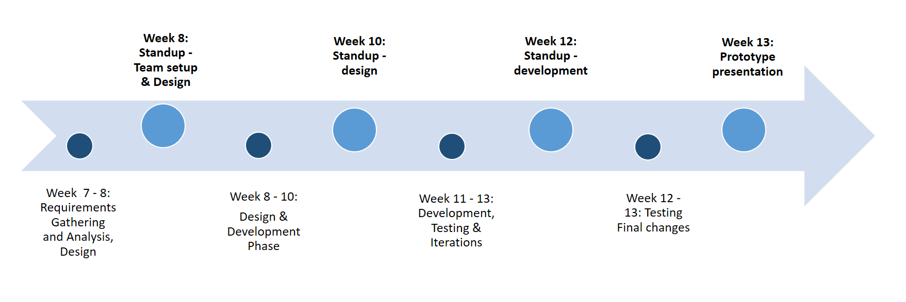

# Fantastic4 - Project Newzy

## Introduction
Nowadays we are able to access national and international news quickly and easy, however statistics show that people who read news 
care more about their regions’ news. For example traffic, crime, emergency, new local policy, shops discount, etc. Abviously we cannot easily get the
local news all together comparing to national and international.

What is the journalistic problem? 
Bias, hard to come into new companies, if you're new it is hard to get in
No good resources, need the people who gererate the news, connection to gumtree for advertisement, excisting local groups on Facebook to get the users,
reward system you get
specific community as a target consumer

What is your project and what dilemma does it aim to address.
Problem Space
Solution

## Concept
App - local news, beacons
journalistic criteria: you need 

outline the idea and the rationale behind it. Define the project aims and audience and
identify how your idea is different from / improves upon other current offerings.

## Team

Our Team name is Fantastic Four which contains four members:
* Fan Feng - DECO3500 
* Dan Lee - DECO3500
* Fatimah Almathami - DECO7350
* Patrick Bartler - DECO7350

Who will lead the team and manage the project;
As we decided on our first group meeting, Dan Lee will be the team leader and manage the project we are going to build throughout the semester. 

who is responsible for logistics e.g. equipment, meetings, transport, etc;
NAME[FIXME] is in charge of logistics for example in purchasing and keeping equipments, organising meetings and recording minutes.

Who fills key roles, e.g. back end, front end, content, design;
* Back end - Patrick Bartler 
* Front end - Fan Feng
* Design - Fatimah Almathami 

How will decisions be made;
Decisions are to be made by all team members’ consent that we all agree to the decision.  By achieving the team consent, we will work on pros and cons for all decisions and figure out  whether the decision is going to be positive for our project.  When consent across the whole team is not the case, a private vote is getting involved and we will make the decision according to the majority of the vote result.  In other case, if the vote fails such as we have the even vote result, the team leader will make the final decision for the team.  Team members must support the decisions made by the decision making processes rightfully.  

How will the team handle poor performance and resolve conflicts.
When a team member has poor performance committing the work divided or assigned, and other team members recognised,  we will manage to handle the poor performance in three steps: Identify the problem, confront poor performance and redirect the behaviour to improve performance.  

When a recognisable poor performance is appeared from a team member, the rest team will have discussion together in identifying the reasons the team member is underperforming, for example the works/tasks assigned to him/her are overloaded, can not match his/her skills, or the time is to short for the team member to finish.  We move to the next step when the problem is identified,  For the best solutions and not making the underperforming team member embarrassed,  immediate and private talk is needed when confronting the poor performance, also we will never confront in anger.  Evidence and data will be brought to the talk to prove how important the team member’s poor performance is and how much it will affect the team performance and project progress and quality.  In the end, we may need to redirect the the tasks accordingly to improve the team member’s poor performance.

When any conflict arises, we will have the resolution of three steps: prepare for resolution, understand the situation and reach agreement.  

Prepare for resolution: We have to first acknowledge the conflict that when the first signs of the conflict are recognised by the team members, then we discuss the conflict with the members that are not involved in the conflict.  The impact and concern regarding to team motivation and work performance will be discussed.  Next step of resolution can be started after everyone involved agreed to a cooperative process.

Understand the situation: When team members are ready to resolve the conflict, the team then needs to understand the situation and each team member has to clarify their positions.  All opinions, ideas, approaches and options are to be collected, clarified and identified on this stage.  Then the team members are going to have small groups of discussion and analyse the issues separately.  In the end, the results of the discussions convene back as a team,  the team should be able to or close to reach agreement on this stage.

Reach Agreement:  On this stage, the team members that have conflict understand each other's’ views and the team is going to make the agreement of what decision to make in settling the conflict.

If the poor performance or conflict is still unsolved by the processes, we will need to contact the course staff for help, which is the last option in resolving the problems. 

## Communications

Where and when will your team meet and how will you all communicate?
Where will files be stored and shared? What are the file naming conventions?
Identify the social platform/s your team has adopted and explain the choice. How will it facilitate
communication and / or file sharing?

We have a weekly group meeting on Tuesday at Room 207 ITEE Student Learning Center, Building 78 UQ, in addition, we will have an online meeting through Skype when necessary, for example if the team is not able to meet at the university and need to have a discussion. The team will communicate through a private slack channel and a Facebook group for general communications.  Phone call is needed for the urgent contact. 

Our files will be stored on GitHub so every group member has the access, also our team has a Google Drive mainly will store our meeting minutes and documents.  

The files will be named in accordance with the file naming conventions that we want the files named in short, but meaningful, consistently and logically.  For example for meeting minutes: “m30-08” for weekly meeting and “om0109” for online meeting, so it is an abbreviation of the meeting form and the date of the meeting in DDMM style.

The social platforms our team has adopted are Slack and Facebook. For the reason we choose Slack is that we have a private team channel under the DECO3500 course chanel, so when using Slack as the tool communicating team members, we can also easily to switch channels to get the course updates and announcements, and ask questions to peers or tutors.   

Facebook is another social platform we adopted. As one of the most popular social platforms in the world, all of our team members use Facebook on different devices and the notifications are most likely turned on at all the time, so we can make sure the messages sent are more likely to be seen to other team members.  In addition, Facebook has the function that detects which team member has seen the messages and posts, so we are able to know if all the members are informed by the certain updates, which is very important.  Different to Slack, Facebook can make a post within a group so other members can like and comment under the post, which is more efficient to have a question and answer conversation than using Slack.     

Both Slack and Facebook are convenient to post and view web links and files such as pdf and images.  

## Plan
Identify the key tasks that need to be completed and when. Identify:
- Project phases e.g. research; requirements; design; construction;
- Key deliverables for each phase (Milestones) ;
- Resources - equipment or other tools/people you might need.

Our key tasks of the project are Requirements Gathering and Analysis, Design, Development, Testing, Final Changes and Documentation/Presentation.
Each phase we have key deliverables depending on the week (see Milestones). We have 4 major milestones during our project in week 8, week 10, week 12 and week 13. In between the different milestones, we have different tasks to work on. The resources we need are listed in the table below.

### Milestones

    

### Resources

Project Phase  | Resources
------------- | -------------
Requirements Gathering and Analysis  | Computer, choice of tools and APIs, installation of the tools, group meetings to be on the same page, documentation, screenshots and/or prototypes
Design 	      | Computer, room for meetings, design prototypes, design software, design requirements, access to pictures, design screenshots, documentation
Development   | Computer, room for meetings, installed tools, API's, costumer to test the product and iterate, webserver, smartphone, documentation 
Testing	      | Computer, room for meetings, costumer to test the product, survey
Final changes | Computer, installed tools, API's, different designs
Presentation/Documentation | PowerPoint presentation, clicker, room to practice the presentation, printer

## Tags
Tag your proposed idea with 5 key concepts from social and mobile lectures (e.g.
awareness, Collaboration, CSCW) and 2 keywords related to journalism and News (e.g. Citizen, Journalists, ...).

**#context-awareness**, **#context-based**, **#user's-environment**, **#interaction**, **#events**, **#local-news**
