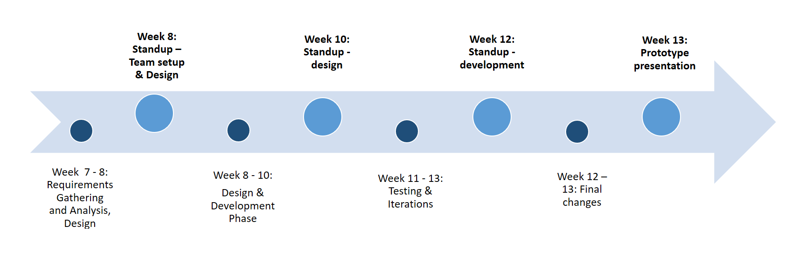

# Fantastic4

## Introduction
Nowadays we are able to access national and international news quickly and easy, however statistics show that people who read news 
care more about their regions’ news. For example traffic, crime, emergency, new local policy, shops discount, etc. Abviously we cannot easily get the
local news all together comparing to national and international.

What is the journalistic problem? 
Bias, hard to come into new companies, if you're new it is hard to get in
No good resources, need the people who gererate the news, connection to gumtree for advertisement, excisting local groups on Facebook to get the users,
reward system you get
specific community as a target consumer

What is your project and what dilemma does it aim to address.
Problem Space
Solution

## Concept
App - local news, beacons
journalistic criteria: you need 

outline the idea and the rationale behind it. Define the project aims and audience and
identify how your idea is different from / improves upon other current offerings.

## Team
Who is on your team, what are their responsibilities, and how will you work together? List all
the members and their course code. Identify:
- Who will lead the team and manage the project;
- Who is responsible for logistics e.g. equipment, meetings, transport, etc;
- Who fills key roles, e.g. back end, front end, content, design;
- How will decisions be made;
- How will the team handle poor performance and resolve conflicts.

## Communications
The team will communicate via a private slack channel. In addition, we will have a weekly group meeting on DAY [FIXME]. Our files will be stored on GitHub
so every group member has the access 

Where and when will your team meet and how will you all communicate?
Where will files be stored and shared? What are the file naming conventions?
Identify the social platform/s your team has adopted and explain the choice. How will it facilitate
communication and / or file sharing?

## Plan
Identify the key tasks that need to be completed and when. Identify:
- Project phases e.g. research; requirements; design; construction;
- Key deliverables for each phase (Milestones) ;
- Resources - equipment or other tools/people you might need.

### Milestones

    

### Resources

Project Phase  | Resources
------------- | -------------
Requirements Gathering and Analysis  | Computer, choice of tools and APIs, installation of the tools, group meetings to be on the same page, documentation, screenshots and/or prototypes
Design Phase  | Computer, room for meetings, design prototypes, design software, design requirements, access to pictures, design screenshots, documentation
Development   | Computer, room for meetings, installed tools, API's, costumer to test the product and iterate, webserver, smartphone, documentation 
Testing	      | Computer, room for meetings, costumer to test the product, survey
Final changes | Computer, installed tools, API's, different designs
Presentation/Documentation | PowerPoint presentation, clicker, room to practice the presentation, 

## Tags
Tag your proposed idea with 5 key concepts from social and mobile lectures (e.g.
awareness, Collaboration, CSCW) and 2 keywords related to journalism and News (e.g. Citizen, Journalists, ...).

**#context-awareness**, **#context-based**, **#user's-environment**, **#interaction**, **#events**, **#local-news**